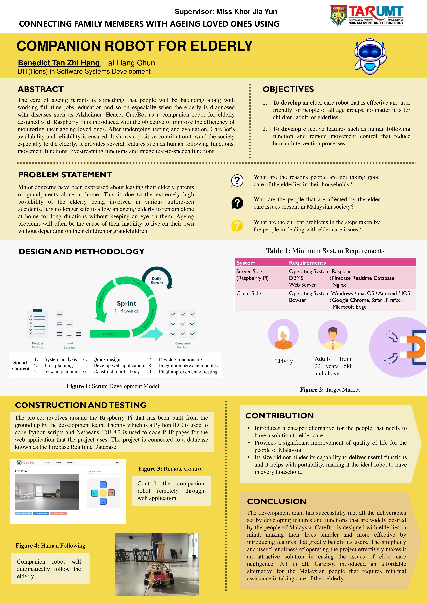

# Companion-Robot-For-Elderly
This is a final year project developed by <b>Benedict Tan Zhi Hang</b> and <b>Lai Liang Chun</b>.
 

 The care of aging parents/grandparents is something that we will be balancing along with working full-time jobs and other issues. It is natural when the family members feel the need to constantly check on their elderly parents/grandparents even when they live a great distance away from them. The care for them is more necessary than ever, especially when they are diagnosed with diseases such as Alzheimer. Caregiving from a far distance comes with many problems and challenges. Therefore, the companion robot for elderly is introduced.  

<h2>Brief Video Introduction</h2>

https://user-images.githubusercontent.com/120158142/206851518-aac6ca45-40e0-43e6-bb48-5d38360fa509.mp4

<h2>Modules</h2>
<b>Assisting Module by Lai Liang Chun</b> 
1. Image Text-to-Speech 
2. Video Streaming  
<b>Movement Module by Benedict Tan Zhi Hang</b> 
1. Human Following 
2. Remote movement control via web app

<h2>Technologies and APIs</h2>
<b>Programming Languages</b> 
 1. PHP 
 2. JavaScript 
 3. Python 
 4. CSS  

<b>APIs</b>
<table style="width: 100%; border: 1px solid black;">
  <tr>
   <td><b>API</b></td>
   <td><b>Description</b></td>
  </tr>
  <tr>
    <td>TensorFlow Lite Python APIs</td>
    <td>Help in tracking for human following function</td>
  </tr>
    <tr>
    <td>OpenCV</td>
    <td>Generating robot’s view with information overlay and used for image processing</td>
  </tr>
    <tr>
    <td>MobileNet SSD v1 (COCO detection API)</td>
    <td>Machine learning model which take one single shot to detect multiple objects within the image, will be using it mainly for human following</td>
  </tr>
    <tr>
    <td>Tesseract OCRs</td>
    <td>Used to extract text from images</td>
  </tr>
    <tr>
    <td>Festival TTS</td>
    <td>Speech synthesis system</td>
  </tr>
</table>

<h2>Poster</h2>

